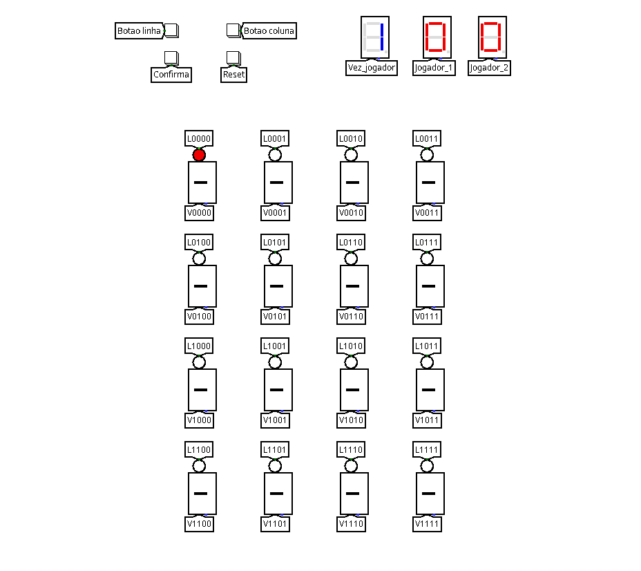
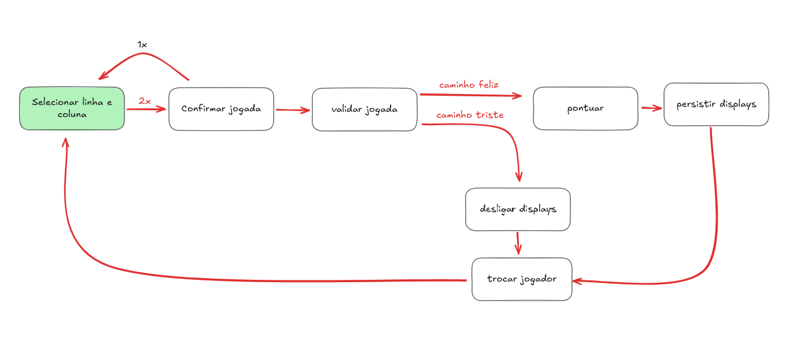
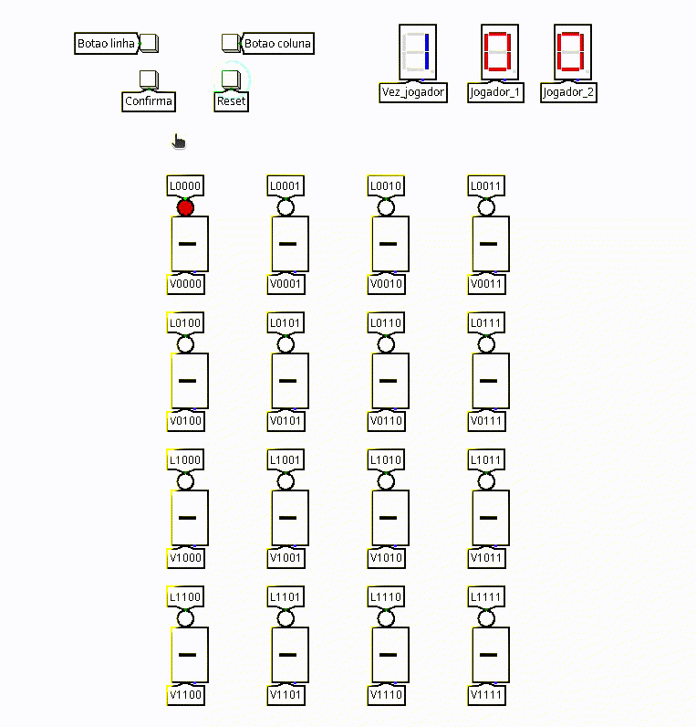
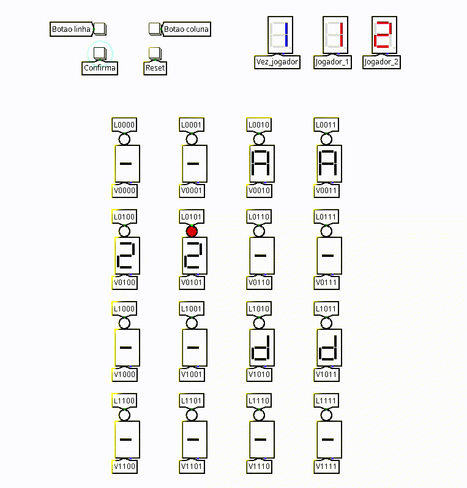
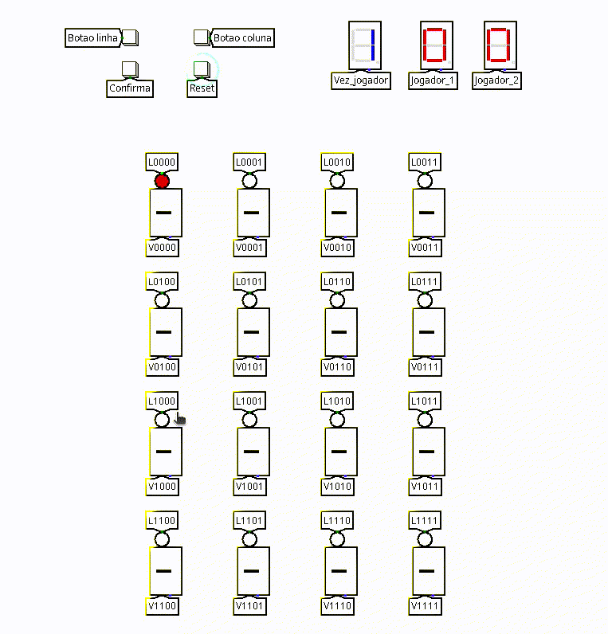

# Jogo da Memória - Implementação em Circuitos Lógicos

## 1. Descrição do Circuito

Este projeto consiste na implementação de um jogo da memória, com um tauleiro 4x4 e um placar. O jogo foi desenvolvido no simulador Logisim durante as aulas de Circuitos Digitais na Universidade Federal do Cariri (UFCA) pelos alunos Otavio da Silva Ferreira e Rafael da Silva Sousa.

### Funcionamento
O jogo da memória consiste em um tabuleiro 4x4 controlado por quatro botões: um para selecionar a linha, um para a coluna, um para confirmar e outro para resetar o jogo. Cada jogador, exibido em um display de 7 segmentos, escolhe uma posição no tabuleiro usando os botões de linha e coluna e pressiona o botão de confirmação para revelar o conteúdo dessa posição, exibido em um display de 7 segmentos. O jogador deve escolher duas posições consecutivas e confirmar novamente para validar a jogada. Se acertar, ganha um ponto, que é mostrado em seu placar; as peças permanecem reveladas. Se errar, as peças voltam a ser ocultadas, e o turno passa para o próximo jogador. Quando todas as peças forem reveladas, o jogo termina. O botão de reset reinicia o tabuleiro, os placares e o turno dos jogadores. 

## 2. Diagramas

### Diagrama Geral

O circuito foi dividido em sete módulos principais:

1. **Escolha da linha e coluna**: Dois botões controlam a seleção de linha e coluna, exibindo os valores escolhidos em displays de 7 segmentos.  

2. **Confirmação da jogada**: Um botão confirma as coordenadas selecionadas, enviando os valores para processamento.  

3. **Validação da jogada**: Um circuito verifica se os valores das posições escolhidas são iguais.  

4. **Pontuar**: Caso a jogada seja válida, incrementa o placar do jogador da vez e exibe a nova pontuação no display.  

5. **Persistir displays**: Caso a jogada seja válida, as posições permanecem reveladas no tabuleiro.  

6. **Reinicializar displays**: Caso a jogada não seja válida, restaura as posições temporariamente reveladas ao estado oculto.  

7. **Inverter jogador**: Caso a jogada não seja válida, alterna automaticamente para o próximo jogador e atualiza o display indicando o jogador da vez.

## 3. Testes

### Metodologia

Os testes foram realizados no Logisim, com todas as combinações de entradas sendo verificadas. O comportamento esperado foi obtido para cada ação.

#### Exemplos de Testes

1. **Jogada feliz**:
   - Escolhendo linha e coluna
   - Fazendo a confirmação
   - Pares iguais
   
   

2. **Jogada triste**:
   - Escolhendo linha e coluna
   - Fazendo a confirmação
   - Pares diferentes

   

3. **Reset**:
   - Resetando o jogo

   

4. **Pares diferentes**:
   - Garantindo a escolha de pares diferentes
   - Fazendo várias confirmações
   - Escolhendo o mesmo display

   

### Resultados Finais

Os testes demonstraram que o circuito funciona corretamente durante as jogadas, exibindo os resultados nos displays de 7 segmentos.
